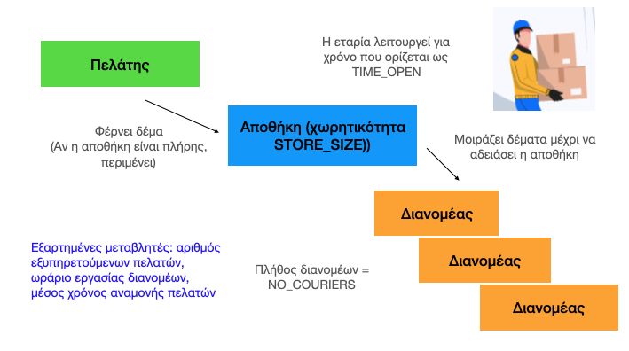

# Λειτουργικά συστήματα: Ελαφρές διεργασίες (Νήματα)

H Python (στην πιο συνηθισμένη διανομή της μέσω CPython) είναι μονο-νηματική. Αυτό οφείλεται στον μηχανισμό GIL (Global Interpreter Lock, Κεντρικός μηχανισμός κλειδώματος διερμηνευτή), ο οποίος δεν επιτρέπει σε πάνω από ένα νήμα να ελέγχει την εκτέλεση του διερμηνευτή της γλώσσας. Αυτό έχει ως συνέπεια, εφαρμογές με πολλαπλά νήματα, οι οποίες κάνουν μεγάλη χρήση της Κεντρικής Μονάδας Επεξεργασίας να μην παρουσιάζουν βελτίωση στην απόδοσή τους σε σχέση με σειριακή εκτέλεση του ίδιου αλγορίθυμου. 


## Διαφοροποίηση πολυνηματικών εφαρμογών CPU-intensive και I/O intensive

Θα πρέπει να σημειωθεί ότι στην περίπτωση εφαρμογών με μεγάλες αναμονές λόγω εντολών εισόδου/εξόδου, πχ διαδραστικές εφαρμογές, ή διαδικτυακές εφαρμογές, η υλοποίηση πολλαπλών νημάτων μπορεί να βελτιώσει την απόδοση, καθώς ενόσω ένα νήμα είναι σε αναμονή εξωτερικού πόρου, άλλα νήματα μπορούν να εκτελεστούν. Κλασσικό τέτοιο παράδειγμα είναι εφαρμογές tkinter στις οποίες τα νήματα μπορεί να βελτιώσουν την εμπειρία του χρήστη κατά την εκτέλεση μεγάλων υπολογισμών ή κατά την αναμονή πόρων του διαδικτύου.

Το παρακάτω παράδειγμα (παράδειγμα από το κεφάλαιο 14 του [Python-εισαγωγή στους υπολογιστές](https://www.cup.gr/book/isagong-stous-ypologistes-me-ti-glossa-python/) ) δείχνει αυτή την αρχή:

```python
# Ενότητα 14.6 Προγραμματισμός με ελαφρές διεργασίες
import threading
from queue import Queue
import time
import sys

NO_THREADS = 5 # πλήθος νημάτων

if len(sys.argv)> 1: task = sys.argv[1]
else: task = 'cpu'

def task1():
    time.sleep(.5)

def task2():
    for i in range(10000):
        x = (i, i**2, i**i)
    
def do_work(item):
    if task == "sleep":
        task1()
    elif task == "cpu":
        task2()

# η ελαφρά διεργασία worker παίρνει ένα αντικείμενο από την ουρά και το επεξεργάζεται
def worker():
    while True:
        item = q.get()
        do_work(item)
        q.task_done()
        
# δημιουργία ουράς q.
#main
q = Queue()
for i in range(NO_THREADS):
     t = threading.Thread(target=worker) # δημιουργείται ελαφρά διεργασία
     t.daemon = True  # .
     t.start()
# τοποθέτησε αντικείμενα για επεξεργασία στην ουρά (εδώ ακεραίους αριθμούς).
start = time.perf_counter()
for item in range(NO_THREADS):
    q.put(item)
q.join()       # block μέχρι να τελειώσουν όλες οι διεργασίες
print(f'\nΣυνολικός χρόνος εκτέλεσης {NO_THREADS} εργασιών: {time.perf_counter() - start:.4f}')

```

Στο πρόγραμμα αυτό εκτελείται μια εργασία από 5 νήματα. Η εργασία αυτη μπορεί να είναι είτε η εργασία αναμονής `task1()` ή η εργασία υπολογισμών `task2()`. Ποια από τις εργασίες θα εκτελεστεί από τα νήματα καθορίζεται από την παράμετρο κατά την κλήση του προγράμματος από τη γραμμή εντολών. Αυτή η παράμετρος μπορεί να πάρει ως τιμή είτε τη συμβολοσειρά 'sleep', ή 'cpu' αντίστοιχα.

Αρχικά εκτελούμε το πρόγραμμα για την περίπτωση της διεργασίας υπολογισμών (παράμετρος 'cpu'), συγκρίνοντας το χρόνο ολοκλήρωσης του παραπάνω προγράμματος(os_threads.py) με μια εναλλακτική έκδοσή του που εκτελεί τις εργασίες σειριακά (os_no_threads.py):

```cli
$ python3 os_no_threads.py cpu
Συνολικός χρόνος εκτέλεσης 5 εργασιών: 30.8472
$
$ python3 os_threads.py cpu
Συνολικός χρόνος εκτέλεσης 5 εργασιών: 30.8016
```

Όπως παρατηρούμε στην περίπτωση αυτή, που η εργασία είναι υπολογιστικού τύπου, δηλαδή απαιτεί μεγάλη χρήση της ΚΜΕ (CPU intensive) ο χρόνος εκτέλεσης της δεν διαφέρει ουσιαστικά στην περίπτωση της σειριακής ή την πολυ-νηματικής έκδοσης της εφαρμογής.

Αν όμως αντίστοιχα τρέξουμε την ίδια εφαρμογή, με την επιλογή 'sleep' που προσομοιώνει μια εφαρμογή με διαστήματα αναμονής εξωτερικών πόρων (I/O intensive), η διαφορά της πολυνηματικής έκδοσης μπορεί να είναι σημαντική, όπως φαίνεται εδώ.

```cli
$ python3 os_no_threads.py sleep
Συνολικός χρόνος εκτέλεσης των 5 εργασιών: 2.5204
$ python3 os_threads.py sleep   
Συνολικός χρόνος εκτέλεσης 5 εργασιών: 0.5054
```
Στο παράδειγμα αυτό είδαμε ένα απλό μηχανισμό δημιουργίας ενός νήματος με τη χρήση της βιβλιοθήκης `threading`

```python
t = threading.Thread(target=worker) # δημιουργείται ελαφρά διεργασία
t.daemon = True  # η ελαφρά διεργασία τρέχει στο υπόβαθρο και δεν επηρεάζεται από τερματισμό της αρχικής διεργασίας
t.start()
```
Θα πρέπει επίσης να επισημανθεί στο πρώτο αυτό παράδειγμα, η χρήση της κλάσης `Queue` της βιβλιοθήκης `queue`, η οποία επιτρέπει να μοιράζονται οι ελαφρές διεργασίες χώρο μνήμης, που εδώ ήταν μια ακολουθία ακεραίων. Μάλιστα θα πρέπει να τονιστεί ότι σε περίπτωση μοιράσματος μνήμης μεταξύ διεργασιών, θα πρέπει να εφαρμοστεί μηχανισμός κλειδώματος για αποφυγή πρόσβασης στον ίδιο πόρο διαφορετικών διεργασιών, ο μηχανισμός αυτός έχει υλοποιηθεί από τη βιβλιοθήκη queue.

Επίσης θα πρέπει να σημειωθεί ότι η κλήση της μεθόδου `Queue.join()` στο παράδειγμά μας εξασφαλίζει ότι το πρόγραμμα δεν θα τερμαστιστεί μέχρι να τερματιστεί και η τελευταία ελαφρά διεργασία, αυτό ώστε να μπορέσουμε να μετρήσουμε τον συνολικό χρόνο εκτέλεσής τους.

## Aσύγχρονης επικοινωνία διεργασιών παραγωγών/καταναλωτών

Σε αυτή την ενότητα θα δούμε ένα πιο σύνθετο παράδειγμα επικοινωνίας διεργασιών, οι οποίες διαχωρίζονται σε διεργασίες παραγωγούς και διεργασίες καταναλωτές (producers/consumers). Οι παραγωγοί γράφουν στον κοινό χώρο και οι καταναλωτές διαβάζουν από τον κοινό χώρο μνήμης.

Θα κάνουμε και εδώ χρήση της κλάσης `Queue` της βιβλιοθήκης `queue`, όπως και το προηγούμενο παράδειγμα. Να σημειωθεί ότι η κλάση `Queue` υλοποιεί μια ουρά FIFO. Αν επιθυμούσαμε ένα άλλο αλγόριθμο ανάκτησης δεδομένων από τον κοινό χώρο, θα μπορούσαμε να χρησιμοποιήσουμε άλλες κλάσεις της `queue`, όπως για παράδειγμα την κλάση `queue.LifoQueue` η οποία υλοποιεί ένα σωρό (stack, LIFO).

Επίσης θα δούμε τη χρήση ενός  πλαισίου λειτουργίας (`context`) που ορίζεται από την βιβλιοθήκη `concurrent.futures` η οποία επιτρέπει την ασύγχρονη κλήση συναρτήσεων, οι οποίες εκτελούνται ως ελαφρές διεργασίες.

Στο παράδειγμα μας, το οποίο υλοποιεί τη λειτουργία μιας εταρίας ταχυμεταφορών, θα δούμε επίσης τον τρόπο συγχρονισμού διεργασιών με χρήση του αντικειμένου `Event` της βιβλιοθήκης `threading`. Για παράδειγμα η διεργασία παραγωγός όταν σταματήσει τη λειτουργία της θα ειδοποιήσει τους καταναλωτές με χρήση ενός event.

Τέλος στο παράδειγμα αυτό θα δούμε έναν πιο αυστηρό τρόπο καταγραφής της λειτουργίας της εφαρμογής με χρήση της βιβλιοθήκης `logging`.

**Το πρόβλημα**. Έστω εταιρία ταχυμεταφορών που περιλαμβάνει διανομείς και πελάτες που φέρνουν δέματα για διανομή. Η εταιρία έχει μια αποθήκη περιορισμένης χωρητικότητας STORE_SIZE, και ορισμένο αριθμό διανομέων που πραγματοποιούν τις παραδόσεις των δεμάτων (NO_COURIERS). Επίσης ορίζουμε τη διάρκεια λειτουργίας της επιχείρησης, μέσω της μεταβλητής TIME_OPEN (σε δευτερόλεπτα προσομοίωσης λειτουργίας).

Επίσης εισάγουμε τυχαιότητα ως προς τον απαιτούμενο χρόνο για την παράδοση κάθε δέματος (τιμές από 0 μέχρι 1 sec.)



Οι κύριες παράμετροι της εταιρίας ταχυμεταφορών.

Η προσομοίωση της λειτουργίας της εφαρμογής αυτής γίνεται με χρήση νημάτων παραγωγών/καταναλωτών. Ένα νήμα είναι ο παραγωγός πληροφορίας που ενημερώνει τον προσομοιωτή για άφιξη ενός νέου δέματος. Ο χώρος στον οποίο εισάγεται η πληροφορία αυτή είναι περιορισμένης χωρητικότητας που προσομοιώνει τον περιορισμένο χώρο αποθήκευσης δεμάτων της εταιρίας. Ο χώρος υλοποιείται με χρήση της κλάσης `Queue` της βιβλιοθήκης `queue`, όπως και στο προηγούμενο παράδειγμα. Επίσης έχουμε έναν αριθμό από καταναλωτές-νήματα που ανακτούν την πληροφορία (ώστε να διανέμουν τα δέματα στους παραλήπτες τους). Το πλήθος των καταναλωτών ορίζεται από την παράμετρο `NO_COURIERS`. Ο συνολικός αριθμός νημάτων (καταναλωτές συνο ο παραγωγός) είναι συνεπώς NO_COURIERS + 1.

Το πλαίσιο της ασύγχρονης λειτουργίας των νημάτων ορίζεται από την κλάση ThreadPoolExecutor. Στο πλαίσιο αυτό οι παραγωγοί και οι καταναλωτές ορίζονται με κλήση της μεθόδου `submit()`


```python
with concurrent.futures.ThreadPoolExecutor(max_workers = NO_COURIERS + 1 ) as executor: # threads pool
        executor.submit(producer, storage, event)
        for _i in range(NO_COURIERS):
            executor.submit(consumer, storage, event, f"courrier {_i+1}")
```

Κατά τον ορισμό κάθε διεργασίας-νήματος περνάμε ως παραμέτρους αναφορά τον κοινό χώρο storage και αναφορά στο αντικείμενο event που θα χρησιμοποιηθεί για ανταλλαγή μηνυμάτων συγχρονισμού μεταξύ του παραγωγού και των καταναλωτών.

Οι μεταβλητές αυτές έχουν ήδη οριστεί:

```python
storage = queue.Queue(maxsize=STORE_SIZE) 
event = threading.Event() 
```

Οι συναρτήσεις που εκτελούνται από τις ελαφρές διεργασίες είναι:

Ο μεν παραγωγός, ο οποίος τοποθετεί νέα μηνύματα στον κοινό χώρο storage με την μέθοδο `put()` της βιβλιοθήκης queue:

```python
def producer(queue, event):
    """Εδώ οι πελάτες παραδίδουν τα δέματα. Αν η αποθήκη έχει γεμίσει, περιμένουν"""
    customers = 0
    waiting = 0
    while not event.is_set(): # ενόσω το μαγαζί είναι ανοικτό παραλαμβάνουμε δέματα
        message = random.randint(1, 101)
        t1 = time.perf_counter()
        queue.put(message)
        customers += 1
        wait = time.perf_counter()-t1
        logging.info(f"Ο πελάτης έστειλε δέμα: {message}, αναμονή = {wait:.5f}", )
        waiting += wait
    logging.info(f"Τερματισμός producer. Δεν δεχόμαστε πλέον δέματα, εξυπηρετήθηκαν {customers} πελάτες, μέση αναμονή: {waiting/customers:.5f}")
```

Οι δε καταναλωτές ανακτούν πληροφορία με τη μέθοδο get():

```python
def consumer(queue, event, id):
    """Ο Courrier μοιράζει τα δέματα στους αποδέκτες."""
    count = 0
    t0 = time.perf_counter()
    while not event.is_set() or not queue.empty(): # όταν κλείσει το μαγαζί **και** αδειάσει η αποθήκη, σχολάμε
        message = queue.get()
        q = queue.qsize()
        time.sleep( random.random())
        logging.info(f"Το δέμα : {message} παραδόθηκε από {id} (δέματα στην αποθήκη={q}) ")
        count += 1
    workLoad = time.perf_counter() - t0
    logging.info(f"Τερματισμός consumer {id}. (σύνολο δεμάτων που παραδόθηκαν: {count},  ωράριο: {workLoad:.5f}")
```

Έχει ενδιαφερον να παρακολουθήσουμε την λειτουργία της εφαρμογής για διάφορες τιμές των παραμέτρων αυτών.

Για τιμές STORE_SIZE = 20, NO_COURIERS = 5, TIME_OPEN = 1 πήραμε το εξής αποτέλεσμα:

    16:52:22: Τερματισμός producer. Δεν δεχόμαστε πλέον δέματα, εξυπηρετήθηκαν 37 πελάτες, μέση αναμονή: 0.02716
    16:52:24: Τερματισμός consumer courrier 2. (σύνολο δεμάτων που παραδόθηκαν: 6,  ωράριο: 3.58907
    16:52:24: Τερματισμός consumer courrier 1. (σύνολο δεμάτων που παραδόθηκαν: 10,  ωράριο: 3.75469
    16:52:24: Τερματισμός consumer courrier 3. (σύνολο δεμάτων που παραδόθηκαν: 7,  ωράριο: 3.77491
    16:52:24: Τερματισμός consumer courrier 5. (σύνολο δεμάτων που παραδόθηκαν: 8,  ωράριο: 3.84280
    16:52:24: Τερματισμός consumer courrier 4. (σύνολο δεμάτων που παραδόθηκαν: 6,  ωράριο: 3.96625

Όταν η χωρητικότητα της αποθήκης μειώθηκε σε STORE_SIZE = 10
αυξήθηκε ο χρόνος αναμονής και εξυπηρετήθηκαν στον ίδιο χρόνο λιγότεροι πελάτες, ενώ οι διανομείς δούλεψαν λιγότερο χρόνο:

    16:57:23: Τερματισμός producer. Δεν δεχόμαστε πλέον δέματα, εξυπηρετήθηκαν 24 πελάτες, μέση αναμονή: 0.04460
    16:57:24: Τερματισμός consumer courrier 4. (σύνολο δεμάτων που παραδόθηκαν: 4,  ωράριο: 2.36243
    16:57:24: Τερματισμός consumer courrier 1. (σύνολο δεμάτων που παραδόθηκαν: 6,  ωράριο: 2.43679
    16:57:24: Τερματισμός consumer courrier 5. (σύνολο δεμάτων που παραδόθηκαν: 5,  ωράριο: 2.48741
    16:57:24: Τερματισμός consumer courrier 3. (σύνολο δεμάτων που παραδόθηκαν: 4,  ωράριο: 2.52258
    16:57:24: Τερματισμός consumer courrier 2. (σύνολο δεμάτων που παραδόθηκαν: 5,  ωράριο: 2.56983

Παρόμοια, όταν ο αριθμός των διανομέων μεγάλωσε: STORE_SIZE = 20, NO_COURIERS = 10, TIME_OPEN = 1, ο χρόνος εργασίας των διανομέων μειώθηκε, αν και τα δέματα που μοιράστηκαν ήταν περισσότερα, όπως φαίνεται στα αποτελέσματα αυτής της περίπτωσης:

    17:01:07: Τερματισμός producer. Δεν δεχόμαστε πλέον δέματα, εξυπηρετήθηκαν 52 πελάτες, μέση αναμονή: 0.01970
    17:01:08: Τερματισμός consumer courrier 10. (σύνολο δεμάτων που παραδόθηκαν: 7,  ωράριο: 2.33130
    17:01:08: Τερματισμός consumer courrier 9. (σύνολο δεμάτων που παραδόθηκαν: 4,  ωράριο: 2.35126
    17:01:08: Τερματισμός consumer courrier 5. (σύνολο δεμάτων που παραδόθηκαν: 7,  ωράριο: 2.38599
    17:01:08: Τερματισμός consumer courrier 4. (σύνολο δεμάτων που παραδόθηκαν: 6,  ωράριο: 2.40980
    17:01:08: Τερματισμός consumer courrier 8. (σύνολο δεμάτων που παραδόθηκαν: 3,  ωράριο: 2.54879
    17:01:08: Τερματισμός consumer courrier 6. (σύνολο δεμάτων που παραδόθηκαν: 5,  ωράριο: 2.57993
    17:01:08: Τερματισμός consumer courrier 1. (σύνολο δεμάτων που παραδόθηκαν: 5,  ωράριο: 2.61876
    17:01:08: Τερματισμός consumer courrier 7. (σύνολο δεμάτων που παραδόθηκαν: 6,  ωράριο: 2.74054
    17:01:08: Τερματισμός consumer courrier 2. (σύνολο δεμάτων που παραδόθηκαν: 5,  ωράριο: 2.88566
    17:01:08: Τερματισμός consumer courrier 3. (σύνολο δεμάτων που παραδόθηκαν: 4,  ωράριο: 2.94853

Φαίνεται ότι η κατανομή των δεμάτων στους καταναλωτές είναι τυχαία και εξαρτάται από τη ροή των νέων δεμάτων και το χρόνο παράδοσης κάθε δέματος.

Στην συνέχεια παρατίθεται ο συνολικός κώδικας της εφαρμογής.


```python
## Κεφάλαιο 14 Λειτουργικά Συστήματα
# ΠΡΟΣΟΜΟΙΩΣΗ ΕΤΑΙΡΙΑΣ ΤΑΧΥΜΕΤΑΦΟΡΩΝ (παράδειγμα επικοινωνίας και συγχρονισμού νημάτων μέσω αντικειμένων Queue και Event)

# η βιβλιοθήκη  threading επιτρέπει τη διαχείριση νημάτων (ελαφρών διεργασιών) - περιλαμβάνει την κλάση Event
# https://docs.python.org/3/library/threading.html?highlight=threading#module-threading
import threading

# η βιβλιοθήκη queue επιτρέπει την επικοινωνία μεταξύ νημάτων - Η κλάση Queue υλοποιεί μηχανισμούς κλειδώματος
# https://docs.python.org/3/library/queue.html?highlight=queue#module-queue
import queue

# https://docs.python.org/3/library/concurrent.futures.html
# concurrent.futures βιβλιοθήκη που επιτρέπει την ασύγχρονη κλήση συναρτήσεων  a high-level interface for asynchronously executing callables
import concurrent.futures

# Η βιβλιοθήκη logging επιτρέπει την καταγραφή συμβάντων, ιδιαίτερα όταν τρέχουν ασύγχρονα νήματα
# https://docs.python.org/3/howto/logging.html
import logging

import time
import random

### άσκηση: μελετήστε πώς επηρεάζει την απόδοση του συστήματος, η τροποποίηση των παραμέτρων STORE_SIZE, NO_COURIERS, TIME_OPEN
# η απόδοση του συστήματος μετριέται με δείκτες όπως: αριθμός εξυπηρετούμενων πελατών, ωράριο εργασίας, μέσος χρόνος αναμονής
# προτείνετε μηχανισμό για βελτιστοποίηση της λειτουργίας της επιχείρησης.

STORE_SIZE = 20  # Χρητικότητα αποθήκης
NO_COURIERS = 5 # πλήθος διανομέων
TIME_OPEN = 1 # προσομοίωση διάρκειας λειτουργίας της επιχείρησης (sec)

def producer(queue, event):
    """Εδώ οι πελάτες παραδίδουν τα δέματα. Αν η αποθήκη έχει γεμίσει, περιμένουν"""
    customers = 0
    waiting = 0
    while not event.is_set(): # ενόσω το μαγαζί είναι ανοικτό παραλαμβάνουμε δέματα
        message = random.randint(1, 101)
        t1 = time.perf_counter()
        queue.put(message)
        customers += 1
        wait = time.perf_counter()-t1
        logging.info(f"Ο πελάτης έστειλε δέμα: {message}, αναμονή = {wait:.5f}", )
        waiting += wait
    logging.info(f"Τερματισμός producer. Δεν δεχόμαστε πλέον δέματα, εξυπηρετήθηκαν {customers} πελάτες, μέση αναμονή: {waiting/customers:.5f}")

def consumer(queue, event, id):
    """Ο Courrier μοιράζει τα δέματα στους αποδέκτες."""
    count = 0
    t0 = time.perf_counter()
    while not event.is_set() or not queue.empty(): # όταν κλείσει το μαγαζί **και** αδειάσει η αποθήκη, σχολάμε
        message = queue.get()
        q = queue.qsize()
        time.sleep( random.random())
        logging.info(f"Το δέμα : {message} παραδόθηκε από {id} (δέματα στην αποθήκη={q}) ")
        count += 1
    workLoad = time.perf_counter() - t0
    logging.info(f"Τερματισμός consumer {id}. (σύνολο δεμάτων που παραδόθηκαν: {count},  ωράριο: {workLoad:.5f}")

if __name__ == "__main__":
    format = "%(asctime)s: %(message)s"
    logging.basicConfig(format=format, level=logging.DEBUG,
                        datefmt="%H:%M:%S")

    storage = queue.Queue(maxsize=STORE_SIZE) # το μέγεθος της αποθήκης της εταιρίας (ουρά FIFO)

    event = threading.Event() # μηχανισμός για επικοινωνία των νημάτων, όταν αυτό ενεργοποιηθεί θα ειδοποιηθούν τα αντίστοιχα νήματα
    # https://docs.python.org/3/library/threading.html?highlight=threading%20event#threading.Event

    with concurrent.futures.ThreadPoolExecutor(max_workers = NO_COURIERS + 1 ) as executor: # threads pool
        executor.submit(producer, storage, event)
        for _i in range(NO_COURIERS):
            executor.submit(consumer, storage, event, f"courrier {_i+1}")
        # η επιχείρηση είναι ανοικτή για ένα διάστημα ....
        time.sleep(TIME_OPEN) # χρόνος λειτουργίας
        # η επιχείρηση κλείνει...
        logging.info("Main: τερματισμός.")
        event.set() # γνωστοποίηση τερματισμού σε άλλα νήματα
```